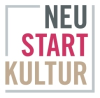

# museum4punkt0 // Materialisierung des Immateriellen im Museum Setup

## Table of contents

* [General Project Information](#information)
* [Short description](#description)
* [Context of creation and funding reference](#funding)
* [Installation](#installation)
* [Usage](#usage)
* [License](#license)

## Information

* Title: Materialisierung des Immateriellen
* Repository: [https://github.com/museum4punkt0/Website-immaterielles-Kulturerbe/](https://github.com/museum4punkt0/Website-immaterielles-Kulturerbe/)
* Reference version: `5av77cc`
* Date: 20.06.2023

## Description

The museum4punkt0 subproject M15 of the Institute for Museum Research of the Staatliche Museen zu
Berlin - Stiftung Preußischer Kulturbesitz (IfM, SMB-PK) explores the possibilities and limits of digital digital mediation of intangible cultural heritage. Intangible cultural heritage is shaped by people passed on from generation to generation as a living tradition.
Digitization and networking expand the technical possibilities for "capturing" intangible cultural heritage in the moment, for "capture" intangible cultural heritage in the moment, pass it on and convey it immersively. At the same time, the platforms and dialog functions of the latest media generation offer a multitude of new possibilities, to get into contact and exchange with a multitude of interested parties independent of location.

The subproject therefore examines the extent to which the newer digital formats, in addition to their technically innovative role, play an important role in terms of preservation and communication.
innovative role in terms of preservation and mediation, the subproject is therefore investigating the extent to which the newer digital formats also make an active contribution to the further development and transformation of intangible cultural heritage.

## Funding

This website was created in the joint project museum4punkt0 - Digital Strategies for the Museum of the Future, sub-project Materialization of the Intangible in the Museum Setup. The project museum4punkt0 is funded by the Federal Government Commissioner for Culture and the Media based on a resolution of the German Bundestag.

Further information: [www.museum4punkt0.de](www.museum4punkt0.de)

.
.

## Installation

### Technical structure of the project

The project is based on the official [Strapi/Next Template](https://github.com/strapi/starters-and-templates/tree/main/packages/starters/next-blog), but uses [Nuxt](https://nuxt.com/) (VueJS) instead of [Next](https://nextjs.org/) (ReactJS).

Technologies used in the front end:

* Vite
* Nuxt
* storybook
* ESLint + typescript

Technologies used in the back end:

* Strapi
* MySQL

### Setup

Before starting the configuration process you need to install the following dependencies:

* [Docker](docker.com)
* [taskfile.dev](taskfile.dev)

### Initialize the application

To show all the possible tasks you can run via the `taskfile.dev`, execute the follwoing command:

```bash
task -l
```

Customize the configurations in the `.env` file.

* Strapi Environment

```markdown
ADMIN_JWT_SECRET=(Token String: ca. 25 zufällige Zeichen)
API_TOKEN_SALT=(Token-String: ca. 25 zufällige Zeichen)
JWT_SECRET=(Token-String: ca. 25 zufällige Zeichen)
APP_KEYS=(mehr als 3 Token mit Komma getrennt)
HOST=0.0.0.0 (localhost für Strapi-Docker-Container-Adresse)
PORT=1337 (Port für Docker-Container-Port)
```

* Nuxt Environment

```markdown
SECRET=(Token String: ca. 25 random characters)
TEXT_CONTENT_API=http://localhost:1337
MAIL_TRANSPORT_HOST=(hostname or ip address of your smtp server)
MAIL_TRANSPORT_PORT=(port number of your smtp server)
MAIL_TRANSPORT_USER=(authentication user of your smtp server)
MAIL_TRANSPORT_PASSWORD=(authentication password of your smtp server)
MAIL_TRANSPORT_TO_ADDRESS=(your email address sending from the contact form)
```

* Frontend Gateway

```markdown
NUXT_SERVER_URL=http://frontend:3000
STRAPI_SERVER_URL=http://backend:1337
```

### Deployment for Staging/Production Environment

To make adjustments for the staging/production environments, adjust the following values in the `docker-compose.(staging|production).yml`.

Domain/Registry

```text
DOCKER_REGISTRY_HOST: location of docker registry
TOP_DOMAIN: top domain
```

Domain Assets

```text
BACKEND_DOMAIN:
FRONTEND_DOMAIN:
FRONTEND_GATEWAY_DOMAIN:
AUTHORIZATION (format is user:token), if needed
```

## Usage

### Maintaining the contents

The content in the `.tar` (Tarball) format must be placed in `strapi/app/public`. Please contact us for providing the Tarball as well as the SQL dump for the Database instance.

### Starting the application

Run the following command in a terminal in the `project-root` directory to start the Docker service.

```bash
docker-compose up --build
```

The built project can then be started with another command:

```bash
docker-compose up
```

Open the browser at [http://localhost:2020](http://localhost:2020).

If you experience problems launching the application, contact us.

## License

[](https://opensource.org/licenses/MIT)

### The MIT License (MIT)

_Permission is hereby granted, free of charge, to any person obtaining a copy of this software and associated documentation files (the "Software"), to deal in the Software without restriction, including without limitation the rights to use, copy, modify, merge, publish, distribute, sublicense, and/or sell copies of the Software, and to permit persons to whom the Software is furnished to do so, subject to the following conditions: The above copyright notice and this permission notice shall be included in all copies or substantial portions of the Software. THE SOFTWARE IS PROVIDED "AS IS", WITHOUT WARRANTY OF ANY KIND, EXPRESS OR IMPLIED, INCLUDING BUT NOT LIMITED TO THE WARRANTIES OF MERCHANTABILITY, FITNESS FOR A PARTICULAR PURPOSE AND NONINFRINGEMENT. IN NO EVENT SHALL THE AUTHORS OR COPYRIGHT HOLDERS BE LIABLE FOR ANY CLAIM, DAMAGES OR OTHER LIABILITY, WHETHER IN AN ACTION OF CONTRACT, TORT OR OTHERWISE, ARISING FROM, OUT OF OR IN CONNECTION WITH THE SOFTWARE OR THE USE OR OTHER DEALINGS IN THE SOFTWARE._

Copyright (c) 2023, HENKELHIEDL GmbH & Co. KG